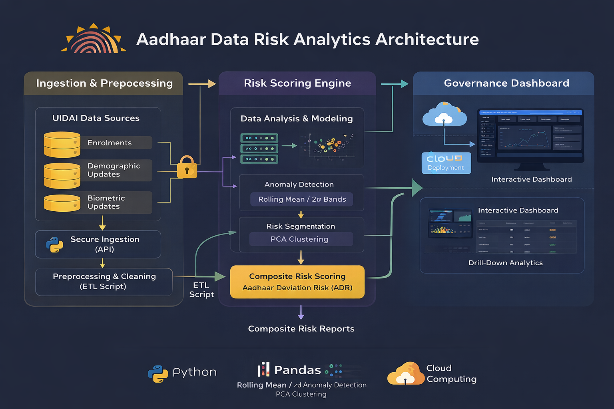
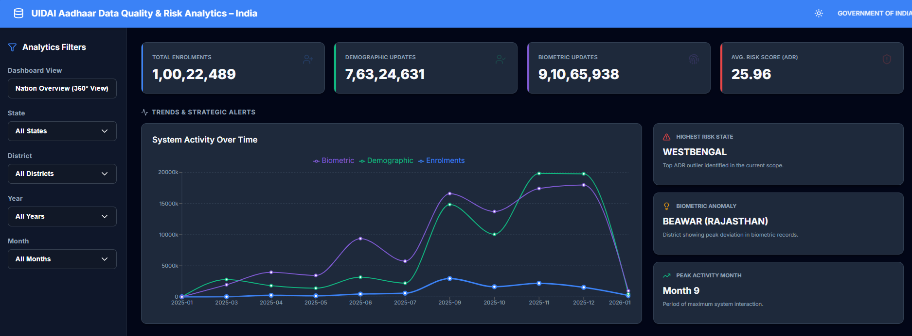
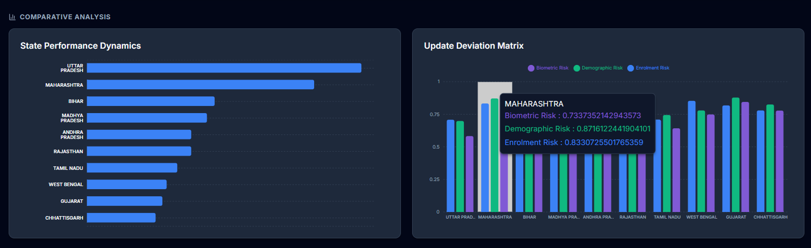
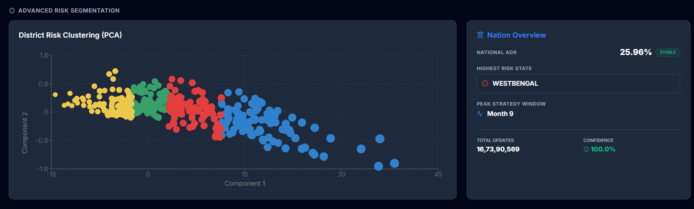
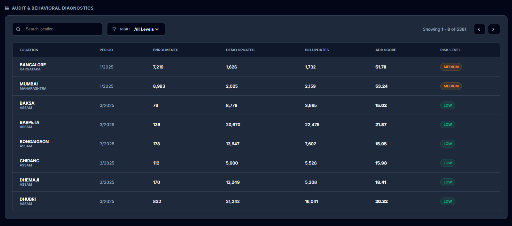

# 📊 UIDAI Aadhaar Data Quality & Risk Analytics Platform  
 


### *All-India & State-Wise Enrollment, Update Stress, and Anomaly Intelligence*

> **A scalable, interpretable, and governance-ready analytics system for detecting operational risk, anomalies, and structural stress in India’s Aadhaar enrollment & update ecosystem.**

---

## 🚀 Project Overview

UIDAI manages **one of the world’s largest biometric identity systems**, serving over **1.5 billion Aadhaar holders**.  
While raw enrollment and update datasets are publicly available, they **do not directly reveal**:

- Regional imbalance  
- Temporal stress patterns  
- Concentration vs sparsity of updates  
- Anomalous or high-risk districts and states  

This project transforms raw UIDAI data into an **actionable decision-support system** using **advanced analytics, anomaly detection, and risk segmentation**.

---

## 🎯 Objectives

- Perform **All-India and State-wise analytical deep dives**
- Quantify **update stress** using enrollment vs update ratios
- Detect **temporal and regional anomalies**
- Build a **composite risk index** for governance and audit prioritization
- Deliver insights via a **professional, interactive dashboard**

---

## 🗂️ Dataset Description

### 📌 Data Sources
- **All-India Aggregated UIDAI Data**
- **State-wise UIDAI Enrollment & Update Data**

### 📌 Data Characteristics
- Structured tabular format  
- Consistent schema across states  
- Minimal missing values  
- Fully **aggregated & anonymized**  
- No personal or biometric identifiers  

> ⚠️ This project is **privacy-safe and ethically compliant** for public analytics.

---

## 🛠️ Tech Stack & Tools

| Category | Tools |
|------|------|
| Language | Python |
| Data Processing | Pandas, NumPy |
| Visualization | Matplotlib, Seaborn |
| Analytics | Statistical modeling, PCA |
| Dashboard | Python-based analytics dashboard |
| Environment | Jupyter Notebook |

---

## 🏗️ System Architecture

<p align="center">
  
  <br>
  <em>
    End-to-end analytics architecture transforming raw UIDAI datasets into anomaly detection,
    risk scoring, segmentation, and governance dashboards.
  </em>
</p>

---

## 🔄 Methodology & Pipeline

```text
Raw UIDAI Data
     ↓
Data Cleaning
     ↓
Preprocessing
     ↓
Feature Engineering
     ↓
Aggregations & Ratios
     ↓
Anomaly Detection
     ↓
Risk Index Construction
     ↓
Dashboard & Insights
```

## 🛠️ Tools & Technologies

| Category | Stack |
|-------|------|
| Programming | **Python** |
| Data Processing | **Pandas**, **NumPy** |
| Visualization | **Matplotlib**, **Seaborn** |
| Statistical Analysis | Rolling Mean, Standard Deviation Thresholding |
| Dimensionality Reduction | **Principal Component Analysis (PCA)** |
| Analytics Focus | Risk Modeling · Anomaly Detection · Governance Analytics |

---

## 📊 Key Metrics Engineered

| Metric | Description |
|------|------------|
| **DUR** | Demographic Update Ratio |
| **BUR** | Biometric Update Ratio |
| **CES** | Child Enrolment Share |
| **ADR** | Composite Anomaly Deviation Risk Score |
| **ALBI** | Aadhaar Load & Balance Index |

> These metrics standardize comparisons across states and districts, enabling interpretable, policy-ready insights.

---
## ⚠️ Assumptions & Limitations
- Analysis based on aggregated UIDAI data
- No individual-level behavioral inference
- Anomalies indicate *operational stress*, not fraud
- Temporal granularity limited to reporting frequency
---

## 🔍 Core Analyses & Insights

### 1️⃣ Update Behaviour Analysis
- Address and mobile update shares exhibit **low variance** across regions  
- Operational risk is primarily driven by **update frequency**, not update type  
- Strong **inter-state structural differences** observed in update behavior  

---

### 2️⃣ Enrolment vs Update Stress
- **Low-enrolment districts** show disproportionately high update volatility  
- High **Child Enrolment Share (CES)** strongly correlates with biometric update stress  
- System stress is **concentrated in specific regions**, not nationwide  

---

### 3️⃣ Anomaly Detection
- Applied **rolling mean with ±2σ deviation bands** for temporal anomaly detection  
- Identified a **system-wide abnormal spike** in a specific operational month  
- Detected **update lag patterns during enrolment surges**, signaling capacity stress  

---

### 4️⃣ Risk Segmentation (PCA-Based)
- Districts segmented using PCA into:
  - 🟢 **Low Risk**
  - 🟡 **Medium Risk**
  - 🔴 **High Risk**
- Enables **targeted audits** instead of blanket monitoring approaches  

---

## 📈 Interactive Analytics Dashboard

The dashboard below translates analytical findings into an interpretable, governance-ready decision support system.

<p align="center">
  
  <br>
  <em>
    National-level analytics overview presenting enrolment volumes, demographic and biometric updates,
    ADR risk score, and temporal system activity trends.
  </em>
</p>

---

<p align="center">
  
  <br>
  <em>
    Comparative state performance dynamics integrating enrolment intensity with demographic,
    biometric, and deviation-based risk indicators.
  </em>
</p>

---

<p align="center">
  
  <br>
  <em>
    PCA-based district risk clustering segmenting operational regions into low, medium,
    and high-risk categories for targeted governance intervention.
  </em>
</p>

---

<p align="center">
  
  <br>
  <em>
    District-level audit and behavioral diagnostics enabling granular inspection of enrolments,
    updates, ADR scores, and operational risk classification.
  </em>
</p>

---

## 🧠 Why This Project Matters
- Public datasets rarely expose operational risk directly
- UIDAI operates at nation-scale → small inefficiencies scale massively
- This system enables *preventive governance*, not reactive audits

---
## 📈 Dashboard Capabilities

- National and State-level **drill-down analytics**
- **Real-time risk monitoring** framework
- District-wise **anomaly heatmaps**
- Trend analysis with **statistical deviation overlays**
- **Interpretability-first design** tailored for governance and policy stakeholders  

---
## 🧩 Project Structure
```
├── dashboard/                     # Final analytics dashboard
├── notebooks/
│   ├── UIDAI_ALL_INDIA.ipynb
│   └── UIDAI_STATES.ipynb
├── data/
│   └── STATE_DATA/
├── report/
│   └── UIDAI_Analysis_Report.pdf
├── assets/                        # README visuals
└── README.md
```

---

## 🎯 Impact & Real-World Value

### Governance Impact
- Strengthens **security and operational integrity** of the Aadhaar ecosystem  
- Enables **resource-efficient, targeted auditing** instead of blanket oversight  
- Reduces systemic risk through **early detection of enrolment and update anomalies**

### System-Level Benefits
- Architected to scale across **national-scale biometric identity systems**  
- Converts complex operational datasets into **policy-ready, actionable insights**  
- Demonstrates strong alignment with **UIDAI’s governance, compliance, and public trust objectives**

---

## 📌 Key Takeaways

> **This project demonstrates that UIDAI’s aggregated operational data can be transformed into an interpretable, anomaly-aware, and governance-ready risk analytics system enabling targeted audits, early stress detection, and data-driven decision-making.**

- Feature-engineered metrics (DUR, BUR, CES, ADR, ALBI) enable **cross-state comparability**
- Statistical deviation thresholds successfully capture **temporal anomalies**
- Low-enrollment districts exhibit **disproportionately high update volatility**
- Child Enrolment Share (CES) correlates strongly with **biometric update pressure**
- Composite ADR scoring provides a scalable proxy for **operational stress detection**
- PCA-based dimensionality reduction reveals **latent district risk structures**

---


---
## 🔮 Future Enhancements
- Time-series forecasting (ARIMA / Prophet)
- Isolation Forest / LOF for anomaly detection
- Real-time streaming dashboard
- District-level capacity optimization models

---
⭐ If you found this project insightful, consider starring the repository.
---
